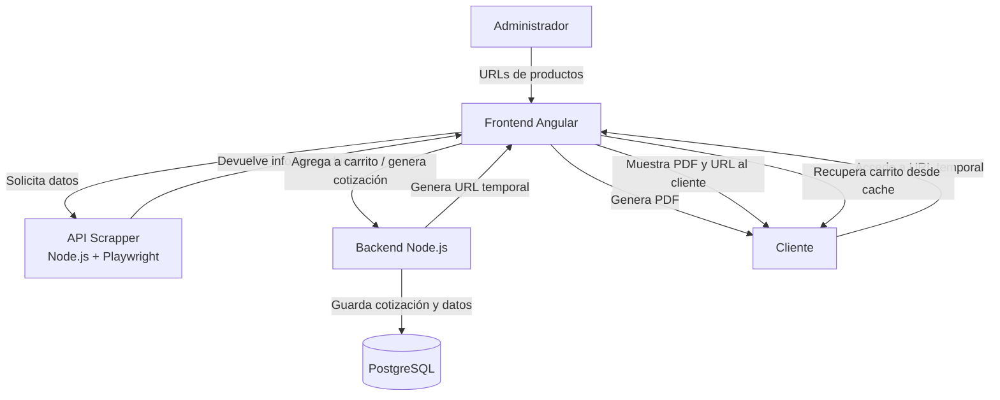
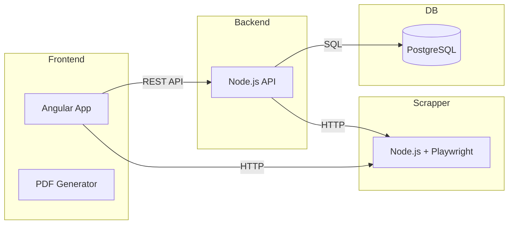
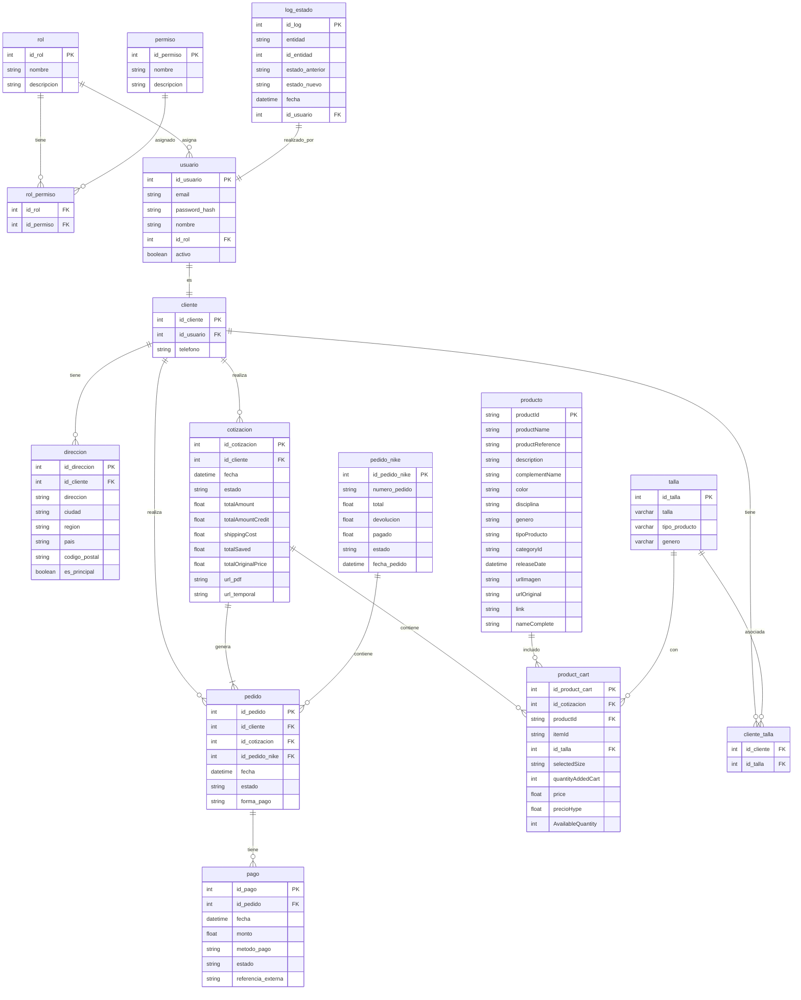
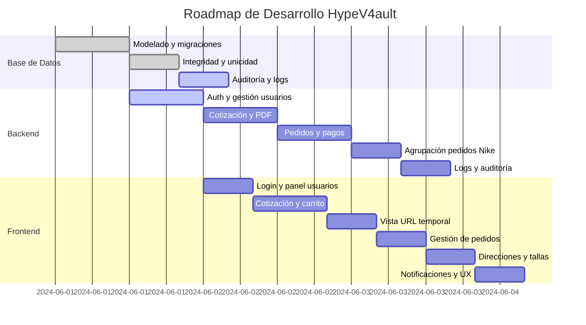
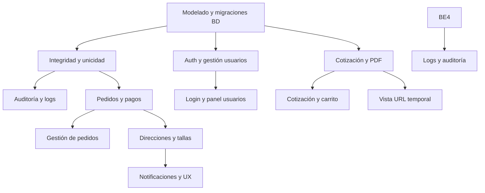

## Índice

0. [Ficha del proyecto](#0-ficha-del-proyecto)
1. [Descripción general del producto](#1-descripción-general-del-producto)
2. [Arquitectura del sistema](#2-arquitectura-del-sistema)
3. [Modelo de datos](#3-modelo-de-datos)
4. [Especificación de la API](#4-especificación-de-la-api)
5. [Historias de usuario](#5-historias-de-usuario)
6. [Tickets de trabajo](#6-tickets-de-trabajo)
7. [Pull requests](#7-pull-requests)

---

## 0. Ficha del proyecto

### **0.1. Tu nombre completo:**
Rubén Contreras
### **0.2. Nombre del proyecto:**
HypeV4ault
### **0.3. Descripción breve del proyecto:**
Tienda digital de productos deportivos y streetwear que genera cotizaciones personalizadas con descuentos embajador de Nike.
### **0.4. URL del proyecto:**

> Puede ser pública o privada, en cuyo caso deberás compartir los accesos de manera segura. Puedes enviarlos a [alvaro@lidr.co](mailto:alvaro@lidr.co) usando algún servicio como [onetimesecret](https://onetimesecret.com/).

### 0.5. URL o archivo comprimido del repositorio

> Puedes tenerlo alojado en público o en privado, en cuyo caso deberás compartir los accesos de manera segura. Puedes enviarlos a [alvaro@lidr.co](mailto:alvaro@lidr.co) usando algún servicio como [onetimesecret](https://onetimesecret.com/). También puedes compartir por correo un archivo zip con el contenido


---

## 1. Descripción general del producto

### 1.1. Objetivo:

HypeV4ault es una plataforma web de e-commerce especializada en la venta de ropa y zapatillas deportivas/streetwear, principalmente productos Nike. El objetivo es ofrecer a los clientes una experiencia de compra personalizada, permitiendo acceder a productos exclusivos y obtener cotizaciones con descuentos especiales por ser embajador de Nike.

### 1.2. Valor agregado:

- **Descuentos exclusivos:** Los usuarios embajadores de Nike acceden a precios especiales y promociones únicas, reflejadas automáticamente en sus cotizaciones.
- **Cotización personalizada:** Cada cliente puede armar su cotización seleccionando productos, tallas, cantidades y formas de pago, recibiendo un resumen detallado y transparente.
- **Acceso a catálogo actualizado:** Los productos se obtienen en tiempo real desde una API externa (scrapper privado), asegurando disponibilidad y variedad.
- **Proceso ágil y digital:** La cotización se genera en PDF y se asocia al cliente, quien recibe una URL temporal para revisar y compartir su propuesta.

### 1.3. Funcionalidades clave:

- **Búsqueda y selección de productos:** El usuario ingresa la URL de un producto Nike y la plataforma obtiene automáticamente toda la información relevante (nombre, descripción, imágenes, tallas disponibles, precio, etc.).
- **Gestión de carrito:** Los productos seleccionados se agregan a un carrito donde se pueden modificar cantidades, tallas y eliminar ítems.
- **Cálculo de descuentos:** El sistema aplica automáticamente el descuento de embajador sobre el precio original, mostrando el ahorro y el precio final ("Precio Hype").
- **Resumen y formas de pago:** Se muestra un resumen del pedido, incluyendo subtotal, ahorro, costo de envío y total, tanto para pago por transferencia como para pago con tarjeta en cuotas.
- **Generación de cotización en PDF:** El usuario puede descargar un PDF profesional con el detalle de su cotización, incluyendo imágenes, tallas, precios originales y con descuento, y enlaces directos a los productos.
- **URL temporal de revisión de carrito:** Tras generar la cotización, se habilita una URL temporal que muestra un carrito estático recuperado desde la base de datos. En esta vista, el usuario puede únicamente modificar la cantidad de productos o eliminarlos, pero no agregar nuevos productos ni realizar otras acciones.

### 1.4. Experiencia esperada del usuario final (cliente):

El cliente accede a HypeV4ault y, de manera intuitiva, ingresa la URL de los productos Nike que desea cotizar. Visualiza la información completa de cada producto, selecciona talla y cantidad, y los agrega a su carrito. El sistema le muestra en todo momento el precio original, el descuento aplicado por ser embajador y el precio final. Puede revisar el resumen de su pedido, elegir la forma de pago y, con un solo clic, descargar un PDF detallado de la cotización. Además, recibe una URL temporal que le permite revisar su carrito estático (recuperado desde la base de datos), donde solo puede modificar cantidades o eliminar productos, pero no agregar nuevos. Todo el proceso es rápido, transparente y enfocado en maximizar el beneficio y la comodidad del cliente.

### **1.5. Diseño y experiencia de usuario:**

#### Flujo principal de experiencia de usuario

1. **Contacto inicial por WhatsApp**  
   El cliente inicia el proceso de compra contactando al equipo de HypeV4ault a través de WhatsApp. En este canal, el cliente expresa su interés en productos Nike específicos, compartiendo enlaces de los artículos que desea cotizar.

2. **Generación de cotización por el administrador**  
   El administrador recibe los enlaces enviados por el cliente y accede al panel de HypeV4ault. Desde allí, ingresa las URLs de los productos Nike en la plataforma, que automáticamente obtiene la información relevante de cada producto (nombre, imagen, tallas disponibles, precio, etc.) mediante un scrapper privado.

3. **Selección de tallas, revisión de precios y aplicación de descuentos**  
   El administrador selecciona las tallas requeridas para cada producto, revisa los precios originales y verifica la aplicación automática del descuento especial por ser embajador de Nike. El sistema muestra el precio original, el descuento aplicado y el precio final para cada artículo.

4. **Generación de PDF y URL de acceso para el cliente**  
   Una vez completada la selección, la plataforma genera un PDF profesional con el detalle de la cotización, incluyendo imágenes, tallas, precios y descuentos. Simultáneamente, se crea una URL temporal que da acceso al cliente a un carrito estático, donde puede revisar la cotización en línea.

5. **Revisión y elección de forma de pago por parte del cliente**  
   El cliente recibe la URL y el PDF de la cotización. Al acceder a la URL, puede revisar el detalle de los productos, modificar cantidades o eliminar artículos si lo desea, pero no puede agregar nuevos productos. El cliente visualiza las opciones de pago disponibles (transferencia o tarjeta en cuotas) y selecciona la que prefiera.

6. **Expiración automática de la cotización**  
   La cotización, tanto en PDF como en la URL temporal, tiene una validez de 2 horas. Si el cliente no realiza el pago dentro de ese plazo, la cotización expira automáticamente y el acceso a la URL se desactiva, garantizando la vigencia de los precios y la disponibilidad de los productos.

> Proporciona imágenes y/o videotutorial mostrando la experiencia del usuario desde que aterriza en la aplicación, pasando por todas las funcionalidades principales.

### **1.6. Instrucciones de instalación:**

A continuación se detallan los pasos para instalar y ejecutar HypeV4ault en un entorno local, sin utilizar Docker. Estas instrucciones están pensadas para programadores que desean probar el sistema por primera vez.

#### Requisitos previos
- Node.js (v18 o superior recomendado)
- npm (v9 o superior recomendado)
- Angular CLI (v18)
- PostgreSQL (puedes usar Railway, Azure SQL o una instancia local)

#### 1. Clonar el repositorio
```bash
# Clona el repositorio en tu máquina
 git clone <URL_DEL_REPOSITORIO>
 cd AI4Devs-finalproject-RCB
```

#### 2. Configurar la base de datos
- Crea una base de datos PostgreSQL (puedes usar Railway, Azure SQL o local).
- Anota el usuario, contraseña, host, puerto y nombre de la base de datos.
- Crea un archivo `.env` en la carpeta `BackEnd/` con la configuración de conexión, por ejemplo:

```
DB_HOST=localhost
DB_PORT=5432
DB_USER=usuario
DB_PASSWORD=contraseña
DB_NAME=hypev4ault
```

#### 3. Instalar dependencias del backend
```bash
cd BackEnd
npm install
```

#### 4. Ejecutar migraciones y semillas (si aplica)
- Si el backend incluye scripts de migración o seed, ejecútalos según la documentación interna del backend (por ejemplo, usando `npm run migrate` o similar).

#### 5. Iniciar el backend
```bash
npm run start
# o
node index.js
```

#### 6. Instalar dependencias del frontend
```bash
cd ../FrontEnd
npm install -g @angular/cli@18 # Si no tienes Angular CLI 18
npm install
```

#### 7. Configurar variables de entorno del frontend
- Si el frontend requiere configuración de endpoints, revisa el archivo `src/environments/environment.development.ts` y ajusta la URL del backend y del scrapper según corresponda.

#### 8. Iniciar el frontend
```bash
ng serve --open
```

#### 9. Acceso a la aplicación
- El frontend estará disponible en `http://localhost:4200` por defecto.
- El backend escuchará en el puerto configurado (por ejemplo, `http://localhost:3000`).

#### Notas adicionales
- Asegúrate de que el backend esté corriendo antes de iniciar el frontend.
- Si usas Railway o Azure SQL, asegúrate de permitir conexiones externas y de actualizar las variables de entorno con los datos correctos.
- Consulta la documentación interna de cada carpeta (`BackEnd/`, `FrontEnd/`) para detalles específicos de configuración, migraciones o scripts adicionales.

---

## 2. Arquitectura del Sistema

La arquitectura de HypeV4ault está orientada a la separación de responsabilidades y la escalabilidad. El sistema se compone de cuatro bloques principales: frontend, backend, base de datos y un scrapper externo, que interactúan mediante APIs REST y HTTP.

### 2.1. Diagrama de arquitectura



#### Descripción del flujo (actualizada)

1. **El administrador** ingresa las URLs de los productos Nike en el **frontend** (Angular).
2. El **frontend** solicita la información de los productos al **scrapper** externo, que responde con los datos necesarios (nombre, tallas, precio, imágenes, etc.).
3. El **frontend** permite armar el carrito y la cotización. El carrito solo existe en el caché del navegador del cliente y su persistencia depende de la opción seleccionada por el usuario.
4. Cuando se genera la cotización, el **frontend** genera el PDF y lo ofrece al cliente para su descarga.
5. El **frontend** envía los datos de la cotización al **backend**, que los guarda en la base de datos y genera una **URL temporal** única para la revisión de la cotización.
6. El **backend** devuelve la URL temporal al **frontend**, que la muestra al cliente junto con el PDF.
7. El **cliente** accede a la URL temporal, que le permite revisar su cotización en una vista estática. En esta vista, el **frontend** recupera el carrito desde el caché local del navegador, permitiendo únicamente modificar cantidades o eliminar productos, pero no agregar nuevos.

**Correcciones y aclaraciones:**
- El **PDF de la cotización se genera en el frontend** (Angular) y se ofrece al cliente para su descarga.
- La **URL temporal** se genera en el backend a partir de los datos guardados en la base de datos y se envía al frontend para que el cliente la reciba.
- El **carrito no se recupera desde la base de datos**: solo existe en el caché del navegador web del cliente y su persistencia depende de la opción seleccionada por el usuario (por ejemplo, si decide mantenerlo o limpiar el carrito).
- Cuando el cliente accede a la URL temporal, el frontend utiliza los datos almacenados en el caché local para mostrar el carrito estático, permitiendo únicamente modificar cantidades o eliminar productos, pero no agregar nuevos.

**Leyenda:**  
- Las flechas indican el flujo de datos entre los componentes principales.  
- Las comunicaciones entre Frontend, Backend y Scrapper se realizan mediante APIs REST/HTTP.  
- El Backend interactúa con la base de datos mediante SQL.

### 2.2. Descripción de componentes principales

#### Frontend (Angular 18)
- **Responsabilidad:** Gestiona la interacción con el usuario, visualización de productos, armado de carrito, generación de cotización y descarga de PDF. Permite al administrador ingresar URLs de productos, seleccionar tallas, aplicar descuentos y generar cotizaciones. El cliente puede revisar su cotización y modificar cantidades o eliminar productos desde la URL temporal.
- **Tecnología:** Angular 18, TypeScript, HTML, CSS.
- **Flujo de comunicación:**
  - Solicita datos de productos a la API externa (scrapper) mediante peticiones HTTP.
  - Envía el carrito y la solicitud de cotización al backend mediante API REST.
  - Recibe el PDF y la URL temporal desde el backend.
  - Permite al cliente interactuar con el carrito estático a través de la URL temporal.

#### Backend (Node.js)
- **Responsabilidad:** Expone una API REST para recibir carritos y cotizaciones, almacena la información en la base de datos, genera PDFs y URLs temporales, y controla la expiración de cotizaciones. Gestiona la lógica de negocio y la persistencia de datos.
- **Tecnología:** Node.js, Express, librerías para generación de PDF, conexión a PostgreSQL.
- **Flujo de comunicación:**
  - Recibe solicitudes del frontend para guardar cotizaciones y carritos.
  - Consulta y actualiza la base de datos PostgreSQL.
  - Genera PDFs y URLs temporales, y responde al frontend.
  - Valida y expira URLs temporales según la lógica de negocio.

#### Base de datos (PostgreSQL)
- **Responsabilidad:** Almacena usuarios, carritos, cotizaciones, productos y URLs temporales. Permite la persistencia y consulta eficiente de la información relevante para el sistema.
- **Tecnología:** PostgreSQL (puede estar alojada en Railway, Azure SQL o local).
- **Flujo de comunicación:**
  - Recibe consultas y actualizaciones desde el backend.
  - Proporciona datos persistentes para la generación de cotizaciones y la gestión de carritos.

#### API externa / Scrapper (Node.js + Playwright)
- **Responsabilidad:** Recibe una URL de producto Nike, navega y extrae la información relevante (nombre, tallas, precio, imágenes) y la devuelve al frontend.
- **Tecnología:** Node.js, Express, Playwright para scraping web.
- **Flujo de comunicación:**
  - Recibe solicitudes HTTP del frontend con la URL del producto.
  - Realiza scraping y devuelve los datos estructurados al frontend.

### 2.3. Descripción de alto nivel del proyecto y estructura de ficheros

```
AI4Devs-finalproject-RCB/
├── BackEnd/         # Backend Node.js (API REST, lógica de negocio, persistencia)
├── FrontEnd/        # Frontend Angular (SPA, UI, lógica de presentación)
│   └── src/
│       └── app/
│           ├── core/      # Modelos y utilidades
│           ├── modules/   # Módulos funcionales (shopping, auth, etc.)
│           └── shared/    # Componentes y servicios compartidos
├── Scrapper/        # Scrapper Node.js + Playwright (API externa de productos)
└── readme.md        # Documentación principal
```

- **BackEnd/**: Lógica de negocio, endpoints, conexión a base de datos, generación de PDFs y URLs temporales.
- **FrontEnd/**: Interfaz de usuario, gestión de carrito, consumo de APIs, generación de PDFs en cliente.
- **Scrapper/**: Servicio de scraping de productos Nike, expuesto como API.

### **2.4. Infraestructura y despliegue**

- El frontend y backend pueden desplegarse en servicios como Vercel, Netlify, Railway, Azure o servidores propios.
- El scrapper puede ejecutarse en un servidor Node.js independiente, idealmente con acceso restringido.
- La base de datos PostgreSQL puede estar en Railway, Azure SQL o un servidor propio.



**Despliegue típico:**
- 1 instancia de frontend (Angular)
- 1 instancia de backend (Node.js)
- 1 instancia de scrapper (Node.js + Playwright)
- 1 instancia de base de datos (PostgreSQL)

**Notas:**
- El **PDF de la cotización se genera en el frontend** (Angular) y se ofrece al cliente para su descarga.
- El backend se encarga de la lógica de negocio, almacenamiento y generación de la URL temporal, pero **no genera el PDF**.

### **2.5. Seguridad**

- CORS configurado en scrapper y backend para restringir orígenes permitidos.
- Validación de datos de entrada en backend y scrapper.
- Expiración automática de URLs temporales para cotizaciones.
- (Por implementar) Autenticación y autorización para el panel de administración.
- (Por implementar) Encriptación de datos sensibles en la base de datos.

### **2.6. Tests**

- Pruebas unitarias en frontend (Angular) para componentes y servicios principales.
- (Por implementar) Pruebas de integración en backend.
- (Por implementar) Pruebas end-to-end para el flujo completo de cotización.

**Gestión de roles y permisos:**
El sistema implementa una arquitectura escalable de roles y permisos. Cada usuario está asociado a un rol, y cada rol puede tener múltiples permisos asignados. Esto permite controlar de forma granular el acceso a funcionalidades administrativas, de cotización, gestión de pedidos, métricas, etc. (Ver sección 3 y sección especial de roles y permisos).

---

## 3. Modelo de Datos

### 3.1. Diagrama del modelo de datos



### 3.2. Descripción de entidades principales

#### rol
- id_rol: int, PK, auto-increment, not null
- nombre: varchar(50), unique, not null
- descripcion: varchar(255), not null

#### permiso
- id_permiso: int, PK, auto-increment, not null
- nombre: varchar(50), unique, not null
- descripcion: varchar(255), not null

#### rol_permiso
- id_rol: int, FK → rol.id_rol, not null
- id_permiso: int, FK → permiso.id_permiso, not null
> Clave primaria compuesta (id_rol, id_permiso). Permite asignar múltiples permisos a cada rol.

#### usuario (actualizado)
- id_usuario: int, PK, auto-increment, not null
- email: varchar(255), unique, not null
- password_hash: varchar(255), not null
- nombre: varchar(100), not null
- id_rol: int, FK → rol.id_rol, not null
- activo: boolean, default true, not null

> El usuario ahora tiene un id_rol como FK, lo que permite una gestión flexible y escalable de roles y permisos.

#### cliente
- id_cliente: int, PK, auto-increment, not null
- id_usuario: int, FK → usuario.id_usuario, unique, not null
- telefono: varchar(20), not null

> 1:1 con usuario (cada usuario tiene un solo cliente asociado).

#### direccion
- id_direccion: int, PK, auto-increment, not null
- id_cliente: int, FK → cliente.id_cliente, not null
- direccion: varchar(255), not null
- ciudad: varchar(100), not null
- region: varchar(100), not null
- pais: varchar(100), not null
- codigo_postal: varchar(20), not null
- es_principal: boolean, default false, not null

> Un cliente puede tener varias direcciones, pero solo una puede ser principal (es_principal = true).

#### cotizacion
- id_cotizacion: int, PK, auto-increment, not null
- id_cliente: int, FK → cliente.id_cliente, not null
- fecha: datetime, not null
- estado: enum('pendiente', 'expirada', 'aceptada'), not null
- totalAmount: decimal(12,2), not null
- totalAmountCredit: decimal(12,2), not null
- shippingCost: decimal(12,2), not null
- totalSaved: decimal(12,2), not null
- totalOriginalPrice: decimal(12,2), not null
- url_pdf: varchar(255), not null
- url_temporal: varchar(255), unique, not null

> La URL temporal debe ser única y expira automáticamente tras 2 horas.

#### pedido
- id_pedido: int, PK, auto-increment, not null
- id_cliente: int, FK → cliente.id_cliente, not null
- id_cotizacion: int, FK → cotizacion.id_cotizacion, not null
- id_pedido_nike: int, FK → pedido_nike.id_pedido_nike, not null
- fecha: datetime, not null
- estado: enum('pagado', 'enviado', 'entregado', 'cancelado'), not null
- forma_pago: varchar(50), not null

> Un pedido siempre está asociado a una cotización aceptada y a un pedido de Nike.

#### pedido_nike
- id_pedido_nike: int, PK, auto-increment, not null
- numero_pedido: varchar(50), unique, not null
- total: decimal(12,2), not null
- devolucion: decimal(5,2), not null  // porcentaje de devolución
- pagado: decimal(12,2), not null
- estado: enum('comprado', 'recibido', 'pendiente dev', 'enviado a dev', 'nota credito lista', 'cancelado'), not null
- fecha_pedido: datetime, not null

> Un pedido de Nike puede agrupar varios pedidos de clientes. El campo devolucion representa el porcentaje de devolución aplicado por Nike.

#### pago
- id_pago: int, PK, auto-increment, not null
- id_pedido: int, FK → pedido.id_pedido, not null
- fecha: datetime, not null
- monto: decimal(12,2), not null
- metodo_pago: varchar(50), not null
- estado: enum('pendiente', 'pagado', 'fallido'), not null
- referencia_externa: varchar(100), nullable

> Un pedido puede tener varios pagos (por ejemplo, abonos o pagos parciales).

#### log_estado
- id_log: int, PK, auto-increment, not null
- entidad: enum('cotizacion', 'pedido', 'pedido_nike'), not null
- id_entidad: int, not null
- estado_anterior: varchar(50), not null
- estado_nuevo: varchar(50), not null
- fecha: datetime, not null
- id_usuario: int, FK → usuario.id_usuario, not null

> Permite auditar todos los cambios de estado en cotizaciones, pedidos y pedidos de Nike.

#### producto
- productId: varchar(50), PK, not null
- productName: varchar(255), not null
- productReference: varchar(100), not null
- description: text, not null
- complementName: varchar(100), not null
- color: varchar(50), not null
- disciplina: varchar(50), not null
- genero: varchar(20), not null
- tipoProducto: varchar(50), not null
- categoryId: varchar(50), not null
- releaseDate: datetime, not null
- urlImagen: varchar(255), not null
- urlOriginal: varchar(255), nullable
- link: varchar(255), not null
- nameComplete: varchar(255), not null

#### product_cart
- id_product_cart: int, PK, auto-increment, not null
- id_cotizacion: int, FK → cotizacion.id_cotizacion, not null
- productId: varchar(50), FK → producto.productId, not null
- itemId: varchar(50), not null
- id_talla: int, FK → talla.id_talla, not null
- selectedSize: varchar(20), not null
- quantityAddedCart: int, not null
- price: decimal(12,2), not null
- precioHype: decimal(12,2), not null
- AvailableQuantity: int, not null

#### talla
- id_talla: int, PK, auto-increment, not null
- talla: varchar(20), not null
- tipo_producto: varchar(50), not null
- genero: varchar(20), not null

#### cliente_talla
- id_cliente: int, FK → cliente.id_cliente, not null
- id_talla: int, FK → talla.id_talla, not null

> Clave primaria compuesta (id_cliente, id_talla). Un cliente puede tener varias tallas preferidas y una talla puede estar asociada a varios clientes.

---

**Notas y reglas especiales:**
- Integridad referencial: Todas las claves foráneas deben estar correctamente definidas y con ON DELETE RESTRICT o CASCADE según la lógica de negocio.
- Unicidad: Emails de usuario, número de pedido de Nike y URL temporal de cotización deben ser únicos.
- Auditoría: Todos los cambios de estado relevantes deben registrarse en log_estado.
- Pagos: Un pedido puede tener varios pagos (por ejemplo, abonos o pagos parciales).
- Pedidos de Nike: Un pedido de Nike puede agrupar varios pedidos de clientes, optimizando la gestión y el cálculo de ganancias.
- Estados: Los estados de cotización, pedido, pedido_nike y pago deben ser controlados y validados por la lógica de negocio.

---

## 3.3. Gestión de roles y permisos

El sistema utiliza un modelo flexible y escalable de roles y permisos:

- **Roles principales sugeridos:**
  - **Administrador:** Acceso total a la gestión de usuarios, cotizaciones, pedidos, pedidos Nike, métricas, direcciones, roles y permisos.
  - **Cliente (cotizador):** Puede crear, editar y agregar productos a sus cotizaciones, ver pedidos pasados, gestionar direcciones, elegir forma de entrega y pagar cotizaciones. No puede cambiar estados de cotización/pedido salvo al pagar online.
  - **Cliente (solo visualización):** Puede ver cotizaciones generadas por el admin, eliminar productos o cambiar cantidad en cotización, ver pedidos pasados, gestionar direcciones y elegir forma de entrega. No puede crear cotizaciones ni cambiar estados.
  - **Cliente no registrado:** Solo puede ver cotizaciones y pedidos asociados a su correo, sin gestión de direcciones ni creación de cotizaciones.

- **Permisos sugeridos:**
  - Gestionar usuarios (crear, editar, eliminar)
  - Ver/gestionar cotizaciones
  - Ver/gestionar pedidos y pedidos Nike
  - Cambiar estados de entidades
  - Ver métricas y paneles administrativos
  - Gestionar direcciones de cualquier cliente
  - Asociar pedidos de clientes a pedidos Nike
  - Gestionar roles y permisos
  - Crear/editar cotizaciones propias
  - Ver pedidos pasados
  - Gestionar direcciones propias
  - Elegir forma de entrega
  - Pagar cotizaciones
  - Eliminar productos/cambiar cantidad en cotización

- **Asignación:**
  - Los permisos se asignan a los roles mediante la tabla `rol_permiso`.
  - Cada usuario tiene un único rol, pero los roles pueden evolucionar y nuevos roles pueden ser creados según necesidades futuras.

---

## 4. Especificación de la API (OpenAPI 3.0 actualizada con roles y permisos)

> **Nota:** Todos los endpoints sensibles requieren validación de token JWT y permisos según el rol del usuario. El backend consulta la tabla de permisos para cada acción y el frontend adapta la UI según los permisos recibidos tras el login.

```yaml
openapi: 3.0.3
info:
  title: HypeV4ault API
  version: 1.0.0
  description: API principal para la gestión de cotizaciones, pedidos, usuarios, roles y administración de HypeV4ault.
servers:
  - url: https://api.hypev4ault.com/v1
    description: Producción
  - url: http://localhost:3000/v1
    description: Desarrollo local

components:
  securitySchemes:
    bearerAuth:
      type: http
      scheme: bearer
      bearerFormat: JWT
  schemas:
    Usuario:
      type: object
      properties:
        id_usuario: { type: integer }
        email: { type: string }
        nombre: { type: string }
        id_rol: { type: integer }
        activo: { type: boolean }
        whatsapp: { type: string }
        instagram: { type: string }
    Rol:
      type: object
      properties:
        id_rol: { type: integer }
        nombre: { type: string }
        descripcion: { type: string }
    Permiso:
      type: object
      properties:
        id_permiso: { type: integer }
        nombre: { type: string }
        descripcion: { type: string }
    Cliente:
      type: object
      properties:
        id_cliente: { type: integer }
        id_usuario: { type: integer }
        telefono: { type: string }
    Direccion:
      type: object
      properties:
        id_direccion: { type: integer }
        id_cliente: { type: integer }
        direccion: { type: string }
        ciudad: { type: string }
        region: { type: string }
        pais: { type: string }
        codigo_postal: { type: string }
        es_principal: { type: boolean }
    Cotizacion:
      type: object
      properties:
        id_cotizacion: { type: integer }
        id_cliente: { type: integer }
        fecha: { type: string, format: date-time }
        estado: { type: string, enum: [pendiente, expirada, aceptada] }
        totalAmount: { type: number }
        totalAmountCredit: { type: number }
        shippingCost: { type: number }
        totalSaved: { type: number }
        totalOriginalPrice: { type: number }
        url_pdf: { type: string }
        url_temporal: { type: string }
        productos: { type: array, items: { $ref: '#/components/schemas/ProductCart' } }
    ProductCart:
      type: object
      properties:
        id_product_cart: { type: integer }
        id_cotizacion: { type: integer }
        productId: { type: string }
        itemId: { type: string }
        id_talla: { type: integer }
        selectedSize: { type: string }
        quantityAddedCart: { type: integer }
        price: { type: number }
        precioHype: { type: number }
        AvailableQuantity: { type: integer }
    Pedido:
      type: object
      properties:
        id_pedido: { type: integer }
        id_cliente: { type: integer }
        id_cotizacion: { type: integer }
        id_pedido_nike: { type: integer }
        fecha: { type: string, format: date-time }
        estado: { type: string, enum: [pagado, enviado, entregado, cancelado] }
        forma_pago: { type: string }
    PedidoNike:
      type: object
      properties:
        id_pedido_nike: { type: integer }
        numero_pedido: { type: string }
        total: { type: number }
        devolucion: { type: number }
        pagado: { type: number }
        estado: { type: string, enum: [comprado, recibido, pendiente dev, enviado a dev, nota credito lista, cancelado] }
        fecha_pedido: { type: string, format: date-time }
    LogEstado:
      type: object
      properties:
        id_log: { type: integer }
        entidad: { type: string, enum: [cotizacion, pedido, pedido_nike] }
        id_entidad: { type: integer }
        estado_anterior: { type: string }
        estado_nuevo: { type: string }
        fecha: { type: string, format: date-time }
        id_usuario: { type: integer }

security:
  - bearerAuth: []

paths:
  /auth/login:
    post:
      summary: Login de usuario
      requestBody:
        required: true
        content:
          application/json:
            schema:
              type: object
              properties:
                email: { type: string }
                password: { type: string }
      responses:
        '200':
          description: JWT, datos del usuario, rol y permisos
          content:
            application/json:
              schema:
                type: object
                properties:
                  token: { type: string }
                  usuario: { $ref: '#/components/schemas/Usuario' }
                  rol: { $ref: '#/components/schemas/Rol' }
                  permisos:
                    type: array
                    items: { $ref: '#/components/schemas/Permiso' }
        '401':
          description: Credenciales inválidas

  /usuarios:
    get:
      summary: Listar usuarios
      security:
        - bearerAuth: []
      responses:
        '200':
          description: Lista de usuarios
          content:
            application/json:
              schema:
                type: array
                items: { $ref: '#/components/schemas/Usuario' }
    post:
      summary: Crear usuario (solo admin)
      security:
        - bearerAuth: []
      requestBody:
        required: true
        content:
          application/json:
            schema:
              type: object
              properties:
                email: { type: string }
                password: { type: string }
                nombre: { type: string }
                id_rol: { type: integer }
                whatsapp: { type: string }
                instagram: { type: string }
      responses:
        '201':
          description: Usuario creado
          content:
            application/json:
              schema:
                $ref: '#/components/schemas/Usuario'

  /usuarios/{id_usuario}/rol:
    patch:
      summary: Cambiar rol de usuario
      security:
        - bearerAuth: []
      parameters:
        - in: path
          name: id_usuario
          required: true
          schema:
            type: integer
      requestBody:
        required: true
        content:
          application/json:
            schema:
              type: object
              properties:
                id_rol: { type: integer }
      responses:
        '200':
          description: Rol actualizado

  /usuarios/{id_usuario}:
    delete:
      summary: Eliminar usuario
      security:
        - bearerAuth: []
      parameters:
        - in: path
          name: id_usuario
          required: true
          schema:
            type: integer
      responses:
        '204':
          description: Usuario eliminado

  /clientes:
    get:
      summary: Listar clientes
      security:
        - bearerAuth: []
      responses:
        '200':
          description: Lista de clientes
          content:
            application/json:
              schema:
                type: array
                items: { $ref: '#/components/schemas/Cliente' }
    post:
      summary: Crear cliente
      security:
        - bearerAuth: []
      requestBody:
        required: true
        content:
          application/json:
            schema:
              $ref: '#/components/schemas/Cliente'
      responses:
        '201':
          description: Cliente creado
          content:
            application/json:
              schema:
                $ref: '#/components/schemas/Cliente'

  /clientes/{id_cliente}/direcciones:
    get:
      summary: Listar direcciones de un cliente
      security:
        - bearerAuth: []
      responses:
        '200':
          description: Lista de direcciones
          content:
            application/json:
              schema:
                type: array
                items: { $ref: '#/components/schemas/Direccion' }
    post:
      summary: Crear dirección para un cliente
      security:
        - bearerAuth: []
      requestBody:
        required: true
        content:
          application/json:
            schema:
              $ref: '#/components/schemas/Direccion'
      responses:
        '201':
          description: Dirección creada
          content:
            application/json:
              schema:
                $ref: '#/components/schemas/Direccion'

  /clientes/{id_cliente}/direcciones/{id_direccion}:
    patch:
      summary: Actualizar dirección
      security:
        - bearerAuth: []
      requestBody:
        required: true
        content:
          application/json:
            schema:
              $ref: '#/components/schemas/Direccion'
      responses:
        '200':
          description: Dirección actualizada
    delete:
      summary: Eliminar dirección
      security:
        - bearerAuth: []
      responses:
        '204':
          description: Dirección eliminada

  /cotizaciones:
    post:
      summary: Crear cotización
      security:
        - bearerAuth: []
      requestBody:
        required: true
        content:
          application/json:
            schema:
              $ref: '#/components/schemas/Cotizacion'
      responses:
        '201':
          description: Cotización creada
          content:
            application/json:
              schema:
                $ref: '#/components/schemas/Cotizacion'
    get:
      summary: Listar cotizaciones (admin o cliente)
      security:
        - bearerAuth: []
      parameters:
        - in: query
          name: estado
          schema:
            type: string
            enum: [pendiente, expirada, aceptada]
        - in: query
          name: id_cliente
          schema:
            type: integer
      responses:
        '200':
          description: Lista de cotizaciones
          content:
            application/json:
              schema:
                type: array
                items: { $ref: '#/components/schemas/Cotizacion' }

  /cotizaciones/{id_cotizacion}:
    get:
      summary: Obtener cotización por ID
      security:
        - bearerAuth: []
      responses:
        '200':
          description: Cotización encontrada
          content:
            application/json:
              schema:
                $ref: '#/components/schemas/Cotizacion'
    patch:
      summary: Editar cotización (admin o cliente)
      security:
        - bearerAuth: []
      requestBody:
        required: true
        content:
          application/json:
            schema:
              $ref: '#/components/schemas/Cotizacion'
      responses:
        '200':
          description: Cotización actualizada
    delete:
      summary: Eliminar cotización
      security:
        - bearerAuth: []
      responses:
        '204':
          description: Cotización eliminada

  /pedidos:
    post:
      summary: Crear pedido a partir de cotización aceptada
      security:
        - bearerAuth: []
      requestBody:
        required: true
        content:
          application/json:
            schema:
              $ref: '#/components/schemas/Pedido'
      responses:
        '201':
          description: Pedido creado
          content:
            application/json:
              schema:
                $ref: '#/components/schemas/Pedido'
    get:
      summary: Listar pedidos (admin o cliente)
      security:
        - bearerAuth: []
      parameters:
        - in: query
          name: estado
          schema:
            type: string
            enum: [pagado, enviado, entregado, cancelado]
        - in: query
          name: id_cliente
          schema:
            type: integer
      responses:
        '200':
          description: Lista de pedidos
          content:
            application/json:
              schema:
                type: array
                items: { $ref: '#/components/schemas/Pedido' }

  /pedidos/{id_pedido}:
    get:
      summary: Obtener pedido por ID
      security:
        - bearerAuth: []
      responses:
        '200':
          description: Pedido encontrado
          content:
            application/json:
              schema:
                $ref: '#/components/schemas/Pedido'
    patch:
      summary: Actualizar estado de pedido
      security:
        - bearerAuth: []
      requestBody:
        required: true
        content:
          application/json:
            schema:
              type: object
              properties:
                estado: { type: string, enum: [pagado, enviado, entregado, cancelado] }
      responses:
        '200':
          description: Estado actualizado

  /pedidos-nike:
    post:
      summary: Crear pedido Nike (admin)
      security:
        - bearerAuth: []
      requestBody:
        required: true
        content:
          application/json:
            schema:
              $ref: '#/components/schemas/PedidoNike'
      responses:
        '201':
          description: Pedido Nike creado
          content:
            application/json:
              schema:
                $ref: '#/components/schemas/PedidoNike'
    get:
      summary: Listar pedidos Nike
      security:
        - bearerAuth: []
      responses:
        '200':
          description: Lista de pedidos Nike
          content:
            application/json:
              schema:
                type: array
                items: { $ref: '#/components/schemas/PedidoNike' }

  /pedidos-nike/{id_pedido_nike}:
    get:
      summary: Obtener pedido Nike por ID y ver pedidos de clientes asociados
      security:
        - bearerAuth: []
      responses:
        '200':
          description: Pedido Nike encontrado
          content:
            application/json:
              schema:
                $ref: '#/components/schemas/PedidoNike'

  /logs:
    get:
      summary: Consultar historial de cambios de estado
      security:
        - bearerAuth: []
      parameters:
        - in: query
          name: entidad
          schema:
            type: string
            enum: [cotizacion, pedido, pedido_nike]
        - in: query
          name: id_entidad
          schema:
            type: integer
      responses:
        '200':
          description: Lista de logs
          content:
            application/json:
              schema:
                type: array
                items: { $ref: '#/components/schemas/LogEstado' }

  /cotizaciones/{id_cotizacion}/visualizar:
    get:
      summary: Visualizar cotización (página estática)
      parameters:
        - in: path
          name: id_cotizacion
          required: true
          schema:
            type: integer
      responses:
        '200':
          description: Página HTML de la cotización
          content:
            text/html:
              schema:
                type: string

  /pedidos/{id_pedido}/visualizar:
    get:
      summary: Visualizar pedido (página estática)
      parameters:
        - in: path
          name: id_pedido
          required: true
          schema:
            type: integer
      responses:
        '200':
          description: Página HTML del pedido
          content:
            text/html:
              schema:
                type: string

# Todos los endpoints anteriores deben estar protegidos por permisos específicos según el rol del usuario. Consulta la sección de roles y permisos para más detalles.
```

---

## 5. Historias de Usuario

### Historia de Usuario 1: Gestión de usuarios y roles (Administrador)

Como **administrador**,
quiero **crear, listar, modificar roles y eliminar usuarios clientes y otros administradores en la plataforma**,
para que **puedan acceder y utilizar HypeV4ault de forma segura y controlada**.

**Criterios de Aceptación:**
- Dado que soy administrador autenticado, cuando accedo al panel de usuarios, entonces puedo ver la lista de usuarios registrados con sus datos principales y su rol.
- Dado que creo un nuevo usuario, cuando ingreso un email, WhatsApp o Instagram ya existente, entonces el sistema muestra un mensaje de error y no permite la creación.
- Dado que selecciono un usuario existente, cuando cambio su rol o lo elimino, entonces el sistema actualiza o elimina el usuario y refleja el cambio en la lista.
- Dado que intento eliminar mi propio usuario (admin), cuando confirmo la acción, entonces el sistema muestra un mensaje de advertencia y no permite la eliminación.
- Dado que gestiono roles y permisos, puedo asignar o modificar los permisos de cada rol desde el panel de administración.

**Notas Adicionales:**
- Solo el administrador puede crear, modificar roles o eliminar usuarios.
- El email y WhatsApp deben ser únicos y válidos.
- UX: Mensajes claros de éxito y error, confirmaciones antes de eliminar.

**Tareas:**
- [ ] Implementar endpoint de creación de usuario (solo admin)
- [ ] Implementar listado, edición de rol y eliminación de usuarios
- [ ] Validar unicidad de email y roles permitidos
- [ ] Mensajes de feedback y validaciones en frontend
- [ ] Pruebas de flujo completo de gestión de usuarios

---

### Historia de Usuario 2: Cotización personalizada y permisos de cliente

Como **cliente con permiso de cotizar**,
quiero **generar cotizaciones personalizadas, editarlas y agregar productos**,
para que **pueda armar mi pedido y solicitarlo al administrador**.

**Criterios de Aceptación:**
- Dado que tengo permiso de cotizar, cuando accedo a la plataforma, puedo crear nuevas cotizaciones, editarlas y agregar productos.
- Dado que genero una cotización, cuando la guardo, entonces se crea un PDF y una URL temporal única válida por 2 horas.
- Dado que intento cambiar el estado de una cotización, el sistema no lo permite salvo que pague online; si pago por transferencia, el admin debe cambiar el estado.
- Dado que soy cliente sin permiso de cotizar, solo puedo ver cotizaciones generadas por el admin, eliminar productos o cambiar cantidad, pero no crear nuevas cotizaciones.

**Notas Adicionales:**
- El PDF debe contener todos los detalles relevantes y la URL debe ser segura y única.
- UX: Mensajes claros de éxito/error, loading al obtener productos.

**Tareas:**
- [ ] Integrar scrapper para obtención de productos
- [ ] Implementar lógica de generación de cotización, PDF y URL temporal
- [ ] Validar que la cotización tenga al menos un producto
- [ ] Implementar expiración automática de la URL
- [ ] Pruebas de expiración y feedback visual

---

### Historia de Usuario 3: Gestión de direcciones y forma de entrega

Como **usuario registrado**,
quiero **gestionar mis direcciones y elegir forma de entrega (presencial o a domicilio)**,
para que **pueda recibir mis pedidos donde prefiera**.

**Criterios de Aceptación:**
- Dado que estoy autenticado, cuando accedo a mi perfil, entonces puedo ver, agregar, editar o eliminar mis direcciones.
- Dado que agrego una nueva dirección y la marco como principal, cuando guardo, entonces el sistema actualiza la dirección principal y desmarca la anterior.
- Dado que elimino una dirección principal, cuando realizo la acción, entonces el sistema solicita que seleccione otra como principal antes de eliminarla.
- Dado que intento agregar una dirección incompleta, cuando guardo, entonces el sistema muestra un mensaje de error.
- Dado que genero un pedido, puedo elegir si la entrega es presencial o a domicilio.

**Notas Adicionales:**
- Un cliente puede tener varias direcciones, pero solo una principal.
- UX: Formularios claros, validaciones y mensajes de feedback.

**Tareas:**
- [ ] Implementar CRUD de direcciones en backend y frontend
- [ ] Validar unicidad de dirección principal y campos obligatorios
- [ ] Pruebas de gestión de direcciones

---

### Historia de Usuario 4: Acceso de clientes no registrados

Como **cliente no registrado**,
quiero **ver las cotizaciones y pedidos asociados a mi correo**,
para que **pueda consultar mis compras aunque no tenga cuenta**.

**Criterios de Aceptación:**
- Dado que recibo una cotización o pedido, cuando accedo al enlace, puedo ver el detalle aunque no tenga cuenta registrada.
- Dado que me registro posteriormente, el sistema asocia mis pedidos y cotizaciones previas a mi nueva cuenta si el correo coincide.
- No puedo gestionar direcciones ni crear cotizaciones.

---

### Notas sobre autenticación y registro

- Un usuario registrado debe tener: correo, WhatsApp y usuario de Instagram únicos (no repetidos en otro usuario).
- El correo y WhatsApp son obligatorios y no pueden repetirse.
- Al registrarse, si el correo ya existe como cliente no registrado, se asocian los pedidos/cotizaciones previas a la nueva cuenta.
- El usuario registrado tendrá contraseña de acceso.

---

### Historia de Usuario 5: Revisión y edición limitada de cotización (Cliente)

Como **cliente**, 
quiero **revisar mi cotización desde una URL temporal y poder modificar cantidades o eliminar productos**, 
para que **pueda ajustar mi pedido antes de aceptarlo y pagarlo**.

**Criterios de Aceptación:**
- Dado que recibo una URL temporal, cuando accedo dentro del plazo de validez, entonces puedo ver el detalle de la cotización y modificar cantidades o eliminar productos.
- Dado que intento agregar nuevos productos desde la URL temporal, cuando realizo la acción, entonces el sistema no lo permite y muestra un mensaje informativo.
- Dado que pasan 2 horas desde la generación, cuando intento acceder a la URL, entonces la cotización está expirada y no es editable.
- Dado que modifico cantidades o elimino productos, cuando guardo los cambios, entonces el sistema actualiza el resumen y el total en tiempo real.

**Notas Adicionales:**
- El cliente solo puede modificar cantidades o eliminar productos desde la URL temporal.
- UX: Mensajes claros de expiración, feedback visual al editar.

**Tareas:**
- [ ] Crear vista estática para revisión y edición limitada de la cotización
- [ ] Implementar lógica de expiración y feedback visual
- [ ] Pruebas de edición y expiración

---

### Historia de Usuario 6: Gestión de pedidos y pagos (Cliente)

Como **cliente**, 
quiero **aceptar una cotización y realizar el pago de mi pedido**, 
para que **pueda recibir mis productos Nike de forma segura y controlada**.

**Criterios de Aceptación:**
- Dado que reviso mi cotización, cuando la acepto, entonces el sistema genera un pedido asociado y me muestra las opciones de pago.
- Dado que selecciono una forma de pago (transferencia o tarjeta), cuando realizo el pago, entonces el sistema registra el pago y actualiza el estado del pedido.
- Dado que intento pagar un pedido ya pagado, cuando realizo la acción, entonces el sistema muestra un mensaje de error y no permite el pago duplicado.
- Dado que el pago es exitoso, cuando consulto el estado, entonces veo el pedido actualizado y recibo confirmación visual.

**Notas Adicionales:**
- El sistema debe soportar pagos parciales y registrar cada abono.
- UX: Mensajes claros de éxito/error, loading en proceso de pago.

**Tareas:**
- [ ] Implementar flujo de aceptación de cotización y generación de pedido
- [ ] Integrar métodos de pago (manual y mercadopago)
- [ ] Validar pagos duplicados y feedback visual
- [ ] Pruebas de flujo completo de pedido y pago

---

### Historia de Usuario 7: Agrupación y gestión de pedidos Nike (Administrador)

Como **administrador**, 
quiero **agrupar varios pedidos de clientes en un solo pedido Nike y gestionar su estado**, 
para que **pueda optimizar la compra y el seguimiento de los pedidos con el proveedor**.

**Criterios de Aceptación:**
- Dado que tengo varios pedidos de clientes, cuando los selecciono y los agrupo, entonces el sistema crea un pedido Nike y asocia los pedidos de clientes seleccionados.
- Dado que cambio el estado de un pedido Nike (ej: recibido, enviado a devolución), cuando realizo la acción, entonces el sistema actualiza el estado y registra el cambio en el historial.
- Dado que intento agrupar pedidos ya asociados a otro pedido Nike, cuando realizo la acción, entonces el sistema muestra un mensaje de error.

**Notas Adicionales:**
- El pedido Nike debe reflejar el total y el porcentaje de devolución correctamente.
- UX: Confirmaciones antes de agrupar, feedback visual de estados.

**Tareas:**
- [ ] Implementar agrupación de pedidos de clientes en pedido Nike
- [ ] Gestión de estados y validaciones
- [ ] Pruebas de agrupación y cambios de estado

---

### Historia de Usuario 8: Visualización de productos y catálogo (Administrador)

Como **administrador**, 
quiero **visualizar el catálogo de productos obtenidos por el scrapper**, 
para que **pueda verificar la información antes de armar cotizaciones**.

**Criterios de Aceptación:**
- Dado que accedo al panel de productos, cuando ingreso una URL, entonces el sistema muestra la información obtenida (nombre, imagen, tallas, precio).
- Dado que la información es incorrecta o falta, cuando lo reporto, entonces el sistema permite registrar un error para revisión.
- Dado que el scrapper falla al obtener datos, cuando ingreso la URL, entonces el sistema muestra un mensaje de error claro.

**Notas Adicionales:**
- UX: Mostrar loading y mensajes de error claros.

**Tareas:**
- [ ] Vista de catálogo y detalle de producto en frontend
- [ ] Endpoint para reporte de errores de scraping
- [ ] Pruebas de visualización y reporte

---

### Historia de Usuario 9: Notificaciones y feedback (Cliente y Admin)

Como **usuario (cliente o admin)**, 
quiero **recibir notificaciones y mensajes claros sobre el estado de mis acciones**, 
para que **pueda saber si mis operaciones fueron exitosas o si hubo algún problema**.

**Criterios de Aceptación:**
- Dado que realizo una acción (crear usuario, cotizar, pagar), cuando la acción es exitosa o falla, entonces recibo un mensaje claro en pantalla.
- Dado que una cotización expira, cuando intento acceder, entonces recibo una notificación de expiración.
- Dado que ocurre un error inesperado, cuando realizo una acción, entonces el sistema muestra un mensaje de error amigable y sugerencias de solución.

**Notas Adicionales:**
- Considerar notificaciones por email para eventos críticos (opcional).
- UX: Mensajes visuales, banners, y alertas contextuales.

**Tareas:**
- [ ] Implementar sistema de notificaciones en frontend
- [ ] Mensajes de error y éxito en todas las acciones principales
- [ ] Pruebas de feedback visual

---

### Historia de Usuario 10: Seguridad y expiración de sesiones (Todos los usuarios)

Como **usuario**, 
quiero **que mi sesión expire automáticamente tras un periodo de inactividad**, 
para que **mis datos estén protegidos si olvido cerrar sesión**.

**Criterios de Aceptación:**
- Dado que estoy inactivo por más de X minutos, cuando intento realizar una acción, entonces el sistema me solicita volver a iniciar sesión.
- Dado que cierro sesión manualmente, cuando lo hago, entonces el sistema elimina el token y me redirige a la pantalla de login.

**Notas Adicionales:**
- Definir tiempo de expiración según mejores prácticas.
- UX: Mensaje previo de expiración y redirección automática.

**Tareas:**
- [ ] Implementar expiración de sesión en frontend y backend
- [ ] Pruebas de expiración y cierre de sesión

---

### Historia de Usuario 11: Auditoría y logs de cambios de estado (Administrador)

Como **administrador**, 
quiero **consultar el historial de cambios de estado de cotizaciones, pedidos y pedidos Nike**, 
para que **pueda auditar el flujo y detectar incidencias o fraudes**.

**Criterios de Aceptación:**
- Dado que accedo al panel de auditoría, cuando filtro por entidad o ID, entonces el sistema muestra el historial de cambios de estado con usuario, fecha y detalle.
- Dado que se realiza un cambio de estado en cualquier entidad, cuando consulto los logs, entonces veo el estado anterior, el nuevo y el usuario responsable.
- Dado que intento consultar logs de una entidad inexistente, cuando realizo la acción, entonces el sistema muestra un mensaje de error.

**Notas Adicionales:**
- Todos los cambios de estado relevantes deben ser registrados automáticamente.
- UX: Filtros y visualización clara del historial.

**Tareas:**
- [ ] Implementar endpoints de consulta de logs
- [ ] Registrar logs en cada cambio de estado relevante
- [ ] Pruebas de auditoría y consulta de logs

---

### Historia de Usuario 0: Inicio de sesión y autenticación

Como **usuario registrado** (cliente o administrador),
quiero **iniciar sesión en la plataforma con mi correo y contraseña**,
para que **pueda acceder a las funcionalidades según mi rol y permisos**.

**Criterios de Aceptación:**
- Dado que ingreso mi correo y contraseña válidos, cuando hago login, entonces el sistema me autentica y me otorga acceso según mi rol y permisos.
- Dado que ingreso credenciales incorrectas, el sistema muestra un mensaje de error y no permite el acceso.
- Dado que inicio sesión correctamente, el sistema me muestra las opciones y funcionalidades permitidas por mi rol.
- Dado que mi sesión expira o cierro sesión, el sistema elimina el token y me redirige a la pantalla de login.

**Notas Adicionales:**
- El login debe devolver el token JWT, los datos del usuario, su rol y los permisos asociados.
- El frontend debe mostrar u ocultar funcionalidades según los permisos recibidos.

---

## 6. Tickets de Trabajo

### 6.1. Roadmap y dependencias técnicas

#### Diagrama Gantt de desarrollo



#### Diagrama de dependencias técnicas



#### Diagrama de flujo de usuario principal

```mermaid
flowchart LR
  A[Login] --> B[Panel de usuario/admin]
  B --> C[Buscar/Agregar productos]
  C --> D[Armar cotización]
  D --> E[Generar PDF y URL temporal]
  E --> F[Cliente revisa cotización]
  F --> G[Modifica cantidades/elimina]
  G --> H[Acepta cotización]
  H --> I[Realiza pago]
  I --> J[Pedido generado]
  J --> K[Admin agrupa en pedido Nike]
  K --> L[Gestión de estados y auditoría]
```



---

### 6.2. Tickets Backend (desglosados)

#### BE1: Autenticación y gestión de usuarios
- **Tareas técnicas:**
  - [ ] Crear modelo y migración de usuario (BD)
  - [ ] Endpoint de login (JWT)
  - [ ] Endpoint de creación de usuario (solo admin)
  - [ ] Endpoint de listado, edición de rol y eliminación
  - [ ] Middleware de autorización por rol
  - [ ] Validaciones de email único y roles
  - [ ] Pruebas unitarias de endpoints
- **Esfuerzo estimado:** 12h / 5 puntos
- **Dependencias:** BD1
- **Prioridad:** Alta

#### BE2: Cotización, PDF y URL temporal
- **Tareas técnicas:**
  - [ ] Integrar scrapper externo (API)
  - [ ] Endpoint para crear cotización
  - [ ] Generación de PDF y almacenamiento
  - [ ] Generación y gestión de URL temporal única
  - [ ] Lógica de expiración automática
  - [ ] Validaciones de productos y totales
  - [ ] Pruebas unitarias y de integración
- **Esfuerzo estimado:** 12h / 5 puntos
- **Dependencias:** BE1, BD1, BD2
- **Prioridad:** Alta

#### BE3: Pedidos y pagos
- **Tareas técnicas:**
  - [ ] Endpoint para crear pedido desde cotización aceptada
  - [ ] Integrar métodos de pago (manual y mercadopago)
  - [ ] Validar pagos parciales y duplicados
  - [ ] Actualización de estados y logs
  - [ ] Pruebas unitarias y de integración
- **Esfuerzo estimado:** 12h / 5 puntos
- **Dependencias:** BE2, BD2
- **Prioridad:** Alta

#### BE4: Agrupación y gestión de pedidos Nike
- **Tareas técnicas:**
  - [ ] Endpoint para agrupar pedidos de clientes
  - [ ] Gestión de estados y validaciones
  - [ ] Actualización de totales y devoluciones
  - [ ] Pruebas unitarias
- **Esfuerzo estimado:** 8h / 3 puntos
- **Dependencias:** BE3, BD2
- **Prioridad:** Media

#### BE5: Logs y auditoría
- **Tareas técnicas:**
  - [ ] Middleware para registrar logs
  - [ ] Endpoint para consultar logs
  - [ ] Filtros por entidad, usuario y fecha
  - [ ] Pruebas unitarias
- **Esfuerzo estimado:** 8h / 3 puntos
- **Dependencias:** BE4, BD3
- **Prioridad:** Media

---

### 6.3. Tickets Frontend (desglosados)

#### FE1: Login y panel de usuarios (Admin)
- **Tareas técnicas:**
  - [ ] Pantalla de login y autenticación JWT
  - [ ] Panel de usuarios: listado, creación, edición de rol y eliminación
  - [ ] Mensajes de feedback y validaciones
  - [ ] Pruebas unitarias de componentes
- **Esfuerzo estimado:** 8h / 3 puntos
- **Dependencias:** BE1
- **Prioridad:** Alta

#### FE2: Cotización y carrito (Admin)
- **Tareas técnicas:**
  - [ ] Formulario para ingresar URLs de productos
  - [ ] Visualización de productos, tallas, cantidades y totales
  - [ ] Generación y descarga de PDF
  - [ ] Pruebas unitarias de componentes
- **Esfuerzo estimado:** 12h / 5 puntos
- **Dependencias:** FE1, BE2
- **Prioridad:** Alta

#### FE3: Vista de URL temporal y edición limitada (Cliente)
- **Tareas técnicas:**
  - [ ] Página estática para revisión de cotización
  - [ ] Edición de cantidades y eliminación de productos
  - [ ] Mensajes de expiración y feedback visual
  - [ ] Pruebas unitarias
- **Esfuerzo estimado:** 8h / 3 puntos
- **Dependencias:** FE2, BE2
- **Prioridad:** Alta

#### FE4: Gestión de pedidos y pagos (Cliente)
- **Tareas técnicas:**
  - [ ] Visualización de pedidos y estados
  - [ ] Integración de métodos de pago y validaciones
  - [ ] Confirmaciones y feedback visual
  - [ ] Pruebas unitarias
- **Esfuerzo estimado:** 8h / 3 puntos
- **Dependencias:** FE3, BE3
- **Prioridad:** Alta

#### FE5: Gestión de direcciones y preferencias de talla (Cliente)
- **Tareas técnicas:**
  - [ ] CRUD de direcciones y tallas preferidas
  - [ ] Validaciones y selección de principal
  - [ ] Pruebas unitarias
- **Esfuerzo estimado:** 8h / 3 puntos
- **Dependencias:** FE4, BE3
- **Prioridad:** Media

#### FE6: Notificaciones y mejoras UX
- **Tareas técnicas:**
  - [ ] Sistema de notificaciones visuales y banners
  - [ ] Mensajes de error, éxito y expiración de sesión
  - [ ] Pruebas unitarias
- **Esfuerzo estimado:** 8h / 3 puntos
- **Dependencias:** FE5
- **Prioridad:** Media

---

### 6.4. Tickets Base de Datos (desglosados)

#### BD1: Modelado y migraciones iniciales
- **Tareas técnicas:**
  - [ ] Crear migraciones para usuario, cliente, producto, talla, cotización, product_cart
  - [ ] Definir claves primarias, foráneas y restricciones básicas
  - [ ] Pruebas de migraciones
- **Esfuerzo estimado:** 12h / 5 puntos
- **Dependencias:** Ninguna
- **Prioridad:** Alta

#### BD2: Integridad referencial y unicidad
- **Tareas técnicas:**
  - [ ] Añadir restricciones de unicidad (email, url temporal, número pedido Nike)
  - [ ] Definir ON DELETE/UPDATE según reglas de negocio
  - [ ] Pruebas de integridad
- **Esfuerzo estimado:** 8h / 3 puntos
- **Dependencias:** BD1
- **Prioridad:** Alta

#### BD3: Auditoría y logs
- **Tareas técnicas:**
  - [ ] Crear tabla y migraciones para log_estado
  - [ ] Triggers o lógica para registrar cambios de estado
  - [ ] Pruebas de logs
- **Esfuerzo estimado:** 8h / 3 puntos
- **Dependencias:** BD2
- **Prioridad:** Media

---

### 6.5. Recomendaciones para trabajo individual

- Prioriza siempre los tickets de mayor dependencia y valor de negocio (ver diagramas).
- Trabaja en ramas separadas para cada ticket y realiza commits frecuentes y descriptivos.
- Usa los puntos de historia para estimar tu velocidad y planificar sprints personales.
- Realiza pruebas unitarias y de integración en cada ticket antes de avanzar al siguiente.
- Documenta cualquier decisión técnica relevante en el README o en comentarios de código.
- Si un ticket resulta más complejo de lo esperado, divídelo en subtareas y reestima el esfuerzo.
- Utiliza los diagramas Mermaid para visualizar tu progreso y dependencias.
- Haz revisiones periódicas de tu avance y ajusta prioridades si es necesario.

---

### 6.6. Buenas prácticas de control de versiones

#### Organización de ramas de git (ejemplo para trabajo individual)

- **main**: Rama principal, siempre estable y lista para producción.
- **develop**: Rama de integración, donde se fusionan los avances antes de pasar a main.
- **feature/<ticket>**: Para cada ticket o funcionalidad nueva. Ejemplo: `feature/BE1-auth-usuarios`
- **bugfix/<ticket>**: Para corrección de errores específicos. Ejemplo: `bugfix/FE3-expiracion-url`
- **hotfix/**: Para correcciones urgentes en producción.

**Flujo recomendado:**
1. Crea una rama desde `develop` para cada ticket:  
   `git checkout develop && git pull && git checkout -b feature/BE2-cotizacion-pdf`
2. Trabaja y haz commits frecuentes y descriptivos.
3. Cuando termines, haz merge a `develop` y elimina la rama de feature.
4. Haz merge de `develop` a `main` solo cuando todo esté probado y estable.

---

#### Plantilla de commit

```
<tipo>(<área o ticket>): <descripción breve>

[opcional] Detalle adicional si es necesario.

Ejemplo:
feat(BE2): integración de scrapper y generación de PDF para cotización
fix(FE3): corrige bug de expiración de URL temporal en vista de cliente
```

**Tipos sugeridos:**
- feat: nueva funcionalidad
- fix: corrección de bug
- refactor: refactorización de código
- docs: cambios en documentación
- test: pruebas
- chore: tareas menores (build, config, etc)

---

#### Plantilla de Pull Request (PR)

```
### Descripción
Breve resumen de lo que resuelve este PR.

### ¿Qué ticket(s) cubre?
- [ ] BE2: Cotización, PDF y URL temporal

### Checklist
- [ ] Código probado localmente
- [ ] Pruebas unitarias/integración actualizadas
- [ ] Documentación actualizada
- [ ] Sin conflictos con develop/main

### Notas adicionales
- (Opcional) Consideraciones técnicas, decisiones tomadas, posibles riesgos.
```

---

## 7. Pull Requests

> Documenta 3 de las Pull Requests realizadas durante la ejecución del proyecto

**Pull Request 1**

**Pull Request 2**

**Pull Request 3**

